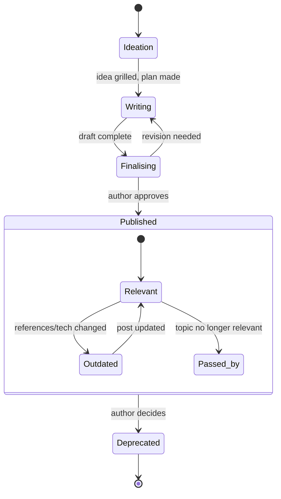

# Oblo — Architecture

Oblo is an AI writing companion that helps turn a seed idea (a couple of sentences) into a published blog post or a longer professional piece — and keeps it alive after publishing.

This document captures the refined design decisions (July 2026). The original brainstorm is preserved in git history.

## Decisions at a glance

| Topic | Decision |
|---|---|
| Foundation | Hybrid: CLI agent engine + thin local web UI for reading, diffing, and reviewing |
| Publishing target | WordPress blog at https://www.schalken.net/ (REST API) + LinkedIn teaser posts |
| Content types | Blog posts and longer professional pieces — one shared pipeline, two output profiles |
| Writing split | Author seeds the idea; Oblo co-writes: expands, restructures, checks references, guards tone, summarizes, suggests improvements |
| Scope | Full lifecycle including monitoring and deprecation |
| Autonomy | Always propose, author approves — nothing goes public without explicit approval |
| Voice | Four combined mechanisms (see Tone of voice) |
| PoC / experiments | Oblo writes the code and experiments; author runs them (for now — see Future) |

## Content types

Both flow through the same lifecycle; they differ only in profile:

| | Blog post | Professional piece |
|---|---|---|
| Length | Short–medium | Long, heavily structured |
| Audience | Knowledgeable peers | Specific professional audience |
| References | Links to docs, blogs, videos | Rigorous, complete reference list — but pragmatic, not academic style |
| Tone | Funny-but-serious, personal | Same voice, dialed slightly more serious |
| Output | WordPress post + LinkedIn teaser | Markdown/PDF, optionally also published as a series |

## Lifecycle

### Phases

1. **Brainstorming** — the author writes a couple of sentences. Every idea needs a goal and a definition of done. Oblo grills the idea: audience, angle, what the reader should take away.
2. **Research** — Oblo does desk research (docs, blogs, videos) and drafts a content plan. Where evidence is needed, Oblo writes the PoC code/notebooks; the author runs them (Databricks, Azure) and pastes back outputs and screenshots.
3. **Gathering evidence** — collect research findings, experiment results, screenshots, references.
4. **Writing** — Oblo expands the material into a draft: full texts, structure, transitions. The author edits; every author edit is a voice lesson (see Tone of voice).
5. **Finalising** — tone-of-voice pass, reference check (links to official docs, other blogs, videos), summary/teaser generation, image work.
6. **Publishing** — on author approval: push to WordPress via the REST API as a draft or scheduled post, generate the LinkedIn teaser. Minimum manual work, but the author clicks the final approve.
7. **Monitoring** — watch referenced documentation and blogs for changes; watch comments. Oblo suggests updates or deprecation when references drift.
8. **Deprecation** — archive posts that are outdated or passed by; optionally publish a pointer to the successor post.

## Agent architecture

Oblo is a multi-agent setup on a Claude-based engine (Claude Code / Claude Agent SDK), with each blog living in a git repository.

| Agent | Role | Model |
|---|---|---|
| Orchestrator / coordinator | Owns the lifecycle state, routes work to specialists, tracks the definition of done | `claude-opus-4-8` |
| Idea generator | Grills seed ideas, proposes angles, maintains blog-ideas.md | `claude-opus-4-8` |
| Researcher | Desk research, source gathering, content planning, writes PoC code/notebooks | `claude-opus-4-8` (web search + fetch tools) |
| Writer | Turns idea + research into a compelling story, following best practices of the best blogs | `claude-opus-4-8` |
| Tone-of-voice editor | Rewrites wording so it's *the author* telling the story; enforces tone-of-voice.md | `claude-opus-4-8` |
| Reference checker | Verifies links, finds official docs, flags dead or drifted references | `claude-opus-4-8` (can step down to `claude-sonnet-5` for cost) |
| Image agent | Generates and fine-tunes images, produces variations | Image generation service (TBD) |
| Comment handler | Classifies comments, drafts replies (see Comment handling) | `claude-opus-4-8` |
| Monitor | Periodic job: re-checks references and comments, raises suggestions | Scheduled agent (cron), `claude-sonnet-5` acceptable for the scanning pass |

(The original open question "gpt-5-mini for the orchestrator?" is resolved: the engine is Claude-based; `claude-opus-4-8` is the default for anything quality-sensitive.)

### Autonomy rules

- **Always propose, author approves.** Publishing a post, posting a LinkedIn teaser, replying to a comment, deleting a comment — all prepared by Oblo, none executed without an explicit approve.
- Internal actions (research, drafting, versioning, generating candidate images) are autonomous.

## Storage & versioning

- Everything is **markdown + PNG**, stored in **git**.
- Mermaid diagrams for structure, processes, and ERDs (rendered via the MarkRead application).
- Multiple named versions of a post can coexist in the same commit (name-based); there is always a **main** version.
- Every change creates a new version; diffs are first-class (inline and side-by-side).

## UI (thin local web UI)

The engine is CLI-first; the UI is a thin layer for what a terminal does badly:

- Render markdown + mermaid (MarkRead-based).
- Show changes inline or side-by-side; compare current version against any past version.
- Select a fragment of a post and request a change on just that part.
- Image module: fine-tune images, generate and compare variations.
- Work on multiple blogs in parallel: tabs/windows, easy to look at and copy from previous posts, easy to reference old posts as context.

## Publishing

- **WordPress (schalken.net)**: via the WordPress REST API (application password). Oblo prepares the post (HTML/blocks, featured image, categories, tags, excerpt) and creates it as a *draft*; author approves → publish.
- **LinkedIn teaser**: Oblo drafts a short teaser linking to the post. Author approves and posts (LinkedIn API access is restrictive; start with copy-paste-ready teasers, automate later if feasible).

## Comment handling

Comments retrieved from WordPress (and LinkedIn reactions/comments where accessible), then classified:

- **Advertisements/spam** → proposed for removal (author approves; may later become a standing rule).
- **Unrelated comments** → not published; deletion proposed to the author.
- **Real comments** → Oblo drafts a reply, considering the entire thread and related comments/answers. Author approves before posting.

## Tone of voice

The voice — a little funny but serious, willing to make a fool of himself to bring the message across, *the author* telling the story — is guarded by four combined mechanisms:

1. **Learn from existing posts** — ingest historical schalken.net posts (and LinkedIn posts) to seed a voice profile.
2. **Explicit style guide** — `tone-of-voice.md`: rules, do/don't examples, favourite phrasings. Every writing agent must follow it.
3. **Learn from edits** — every author rewrite of Oblo's wording is captured as a diff and distilled into style-guide updates.
4. **Per-post interviews** — for each post, Oblo asks how the author would say key things out loud and reuses the actual phrasings.

## Monitoring

A scheduled agent periodically:

- Re-fetches referenced documentation and blogs; if they changed meaningfully, suggests a post update or deprecation.
- Checks for new comments and runs the comment-handling flow.
- Reports findings as proposals in the review queue — never acts publicly on its own.

## Future: Oblo runs the experiments

Currently Oblo writes PoC code and the author executes it. The envisioned next step: give Oblo controlled access to a Databricks workspace / Azure sandbox so it can run the experiments itself, capture outputs and screenshots, and feed them straight into the evidence phase. Requires credentials, cost guardrails, and an isolated sandbox — deliberately out of scope for now.

## Open questions

- WordPress: confirm REST API access and application-password setup on schalken.net.
- Image generation: which service/model, and how the image module integrates with the UI.
- LinkedIn: API automation feasibility vs. copy-paste teasers.
- MarkRead: integration point for rendering (embed vs. reuse components).
